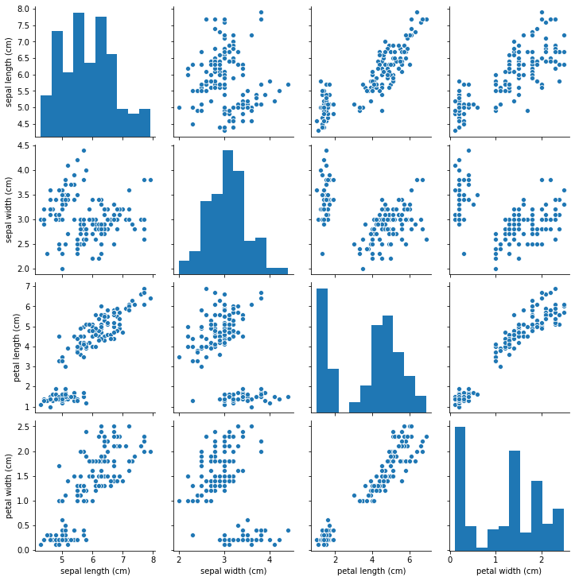
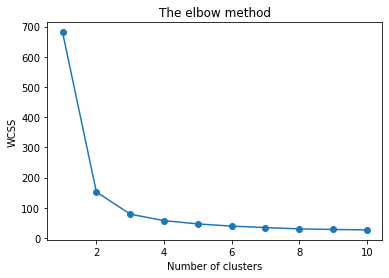
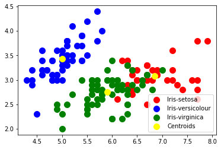
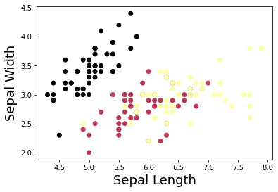
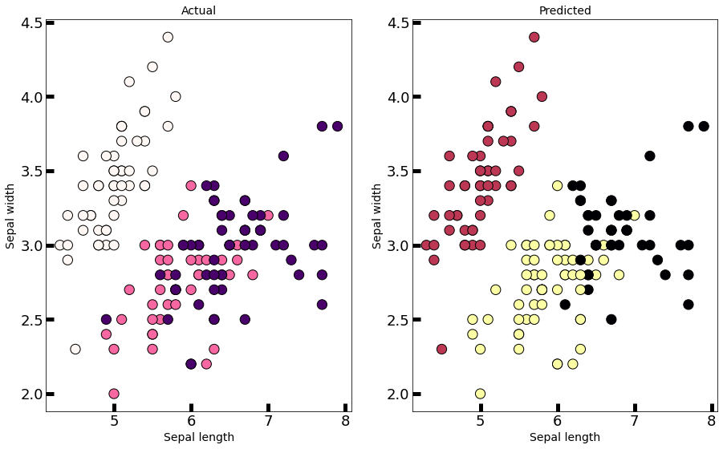

##  ***The Sparks Foundation - Data Science and Business Analytics Internship***

### ***Task no. 2 - Prediction using unsupervised Machine Learning***

#### *Problem Statement - From the given 'Iris' Dataset predict the optimum number of cluster and represent it visually.*

### Step 1 - Importing Libraries 


```python
import numpy as np
import pandas as pd
import matplotlib.pyplot as plt
%matplotlib inline
from sklearn import datasets
import seaborn as sns
```

### Step 2 - Loading the Data


```python
# Load the iris dataset
iris = datasets.load_iris()
iris_df = pd.DataFrame(iris.data, columns = iris.feature_names)
iris_df.head() # See the first 5 rows
```


<div>
<style scoped>
    .dataframe tbody tr th:only-of-type {
        vertical-align: middle;
    }

    .dataframe tbody tr th {
        vertical-align: top;
    }

    .dataframe thead th {
        text-align: right;
    }
</style>
<table border="1" class="dataframe">
  <thead>
    <tr style="text-align: right;">
      <th></th>
      <th>sepal length (cm)</th>
      <th>sepal width (cm)</th>
      <th>petal length (cm)</th>
      <th>petal width (cm)</th>
    </tr>
  </thead>
  <tbody>
    <tr>
      <th>0</th>
      <td>5.1</td>
      <td>3.5</td>
      <td>1.4</td>
      <td>0.2</td>
    </tr>
    <tr>
      <th>1</th>
      <td>4.9</td>
      <td>3.0</td>
      <td>1.4</td>
      <td>0.2</td>
    </tr>
    <tr>
      <th>2</th>
      <td>4.7</td>
      <td>3.2</td>
      <td>1.3</td>
      <td>0.2</td>
    </tr>
    <tr>
      <th>3</th>
      <td>4.6</td>
      <td>3.1</td>
      <td>1.5</td>
      <td>0.2</td>
    </tr>
    <tr>
      <th>4</th>
      <td>5.0</td>
      <td>3.6</td>
      <td>1.4</td>
      <td>0.2</td>
    </tr>
  </tbody>
</table>
</div>


```python
sns.pairplot(iris_df)
```


    <seaborn.axisgrid.PairGrid at 0x121bc175580>





From the above pairplot we can infere that speices is mainly dependent on petal length and petal width

### Step 3 - Finding the Optimum number of clusters


```python
# Finding the optimum number of clusters for k-means classification

x = iris_df.iloc[:, [0, 1, 2, 3]].values
print(x)  

from sklearn.cluster import KMeans
wcss = []

for i in range(1, 11):
    kmeans = KMeans(n_clusters = i, init = 'k-means++', 
                    max_iter = 300, n_init = 10, random_state = 0)
    kmeans.fit(x)
    wcss.append(kmeans.inertia_)
```

    [[5.1 3.5 1.4 0.2]
     [4.9 3.  1.4 0.2]
     [4.7 3.2 1.3 0.2]
     [4.6 3.1 1.5 0.2]
     [5.  3.6 1.4 0.2]
     [5.4 3.9 1.7 0.4]
     [4.6 3.4 1.4 0.3]
     [5.  3.4 1.5 0.2]
     [4.4 2.9 1.4 0.2]
     [4.9 3.1 1.5 0.1]
     [5.4 3.7 1.5 0.2]
     [4.8 3.4 1.6 0.2]
     [4.8 3.  1.4 0.1]
     [4.3 3.  1.1 0.1]
     [5.8 4.  1.2 0.2]
     [5.7 4.4 1.5 0.4]
     [5.4 3.9 1.3 0.4]
     [5.1 3.5 1.4 0.3]
     [5.7 3.8 1.7 0.3]
     [5.1 3.8 1.5 0.3]
     [5.4 3.4 1.7 0.2]
     [5.1 3.7 1.5 0.4]
     [4.6 3.6 1.  0.2]
     [5.1 3.3 1.7 0.5]
     [4.8 3.4 1.9 0.2]
     [5.  3.  1.6 0.2]
     [5.  3.4 1.6 0.4]
     [5.2 3.5 1.5 0.2]
     [5.2 3.4 1.4 0.2]
     [4.7 3.2 1.6 0.2]
     [4.8 3.1 1.6 0.2]
     [5.4 3.4 1.5 0.4]
     [5.2 4.1 1.5 0.1]
     [5.5 4.2 1.4 0.2]
     [4.9 3.1 1.5 0.2]
     [5.  3.2 1.2 0.2]
     [5.5 3.5 1.3 0.2]
     [4.9 3.6 1.4 0.1]
     [4.4 3.  1.3 0.2]
     [5.1 3.4 1.5 0.2]
     [5.  3.5 1.3 0.3]
     [4.5 2.3 1.3 0.3]
     [4.4 3.2 1.3 0.2]
     [5.  3.5 1.6 0.6]
     [5.1 3.8 1.9 0.4]
     [4.8 3.  1.4 0.3]
     [5.1 3.8 1.6 0.2]
     [4.6 3.2 1.4 0.2]
     [5.3 3.7 1.5 0.2]
     [5.  3.3 1.4 0.2]
     [7.  3.2 4.7 1.4]
     [6.4 3.2 4.5 1.5]
     [6.9 3.1 4.9 1.5]
     [5.5 2.3 4.  1.3]
     [6.5 2.8 4.6 1.5]
     [5.7 2.8 4.5 1.3]
     [6.3 3.3 4.7 1.6]
     [4.9 2.4 3.3 1. ]
     [6.6 2.9 4.6 1.3]
     [5.2 2.7 3.9 1.4]
     [5.  2.  3.5 1. ]
     [5.9 3.  4.2 1.5]
     [6.  2.2 4.  1. ]
     [6.1 2.9 4.7 1.4]
     [5.6 2.9 3.6 1.3]
     [6.7 3.1 4.4 1.4]
     [5.6 3.  4.5 1.5]
     [5.8 2.7 4.1 1. ]
     [6.2 2.2 4.5 1.5]
     [5.6 2.5 3.9 1.1]
     [5.9 3.2 4.8 1.8]
     [6.1 2.8 4.  1.3]
     [6.3 2.5 4.9 1.5]
     [6.1 2.8 4.7 1.2]
     [6.4 2.9 4.3 1.3]
     [6.6 3.  4.4 1.4]
     [6.8 2.8 4.8 1.4]
     [6.7 3.  5.  1.7]
     [6.  2.9 4.5 1.5]
     [5.7 2.6 3.5 1. ]
     [5.5 2.4 3.8 1.1]
     [5.5 2.4 3.7 1. ]
     [5.8 2.7 3.9 1.2]
     [6.  2.7 5.1 1.6]
     [5.4 3.  4.5 1.5]
     [6.  3.4 4.5 1.6]
     [6.7 3.1 4.7 1.5]
     [6.3 2.3 4.4 1.3]
     [5.6 3.  4.1 1.3]
     [5.5 2.5 4.  1.3]
     [5.5 2.6 4.4 1.2]
     [6.1 3.  4.6 1.4]
     [5.8 2.6 4.  1.2]
     [5.  2.3 3.3 1. ]
     [5.6 2.7 4.2 1.3]
     [5.7 3.  4.2 1.2]
     [5.7 2.9 4.2 1.3]
     [6.2 2.9 4.3 1.3]
     [5.1 2.5 3.  1.1]
     [5.7 2.8 4.1 1.3]
     [6.3 3.3 6.  2.5]
     [5.8 2.7 5.1 1.9]
     [7.1 3.  5.9 2.1]
     [6.3 2.9 5.6 1.8]
     [6.5 3.  5.8 2.2]
     [7.6 3.  6.6 2.1]
     [4.9 2.5 4.5 1.7]
     [7.3 2.9 6.3 1.8]
     [6.7 2.5 5.8 1.8]
     [7.2 3.6 6.1 2.5]
     [6.5 3.2 5.1 2. ]
     [6.4 2.7 5.3 1.9]
     [6.8 3.  5.5 2.1]
     [5.7 2.5 5.  2. ]
     [5.8 2.8 5.1 2.4]
     [6.4 3.2 5.3 2.3]
     [6.5 3.  5.5 1.8]
     [7.7 3.8 6.7 2.2]
     [7.7 2.6 6.9 2.3]
     [6.  2.2 5.  1.5]
     [6.9 3.2 5.7 2.3]
     [5.6 2.8 4.9 2. ]
     [7.7 2.8 6.7 2. ]
     [6.3 2.7 4.9 1.8]
     [6.7 3.3 5.7 2.1]
     [7.2 3.2 6.  1.8]
     [6.2 2.8 4.8 1.8]
     [6.1 3.  4.9 1.8]
     [6.4 2.8 5.6 2.1]
     [7.2 3.  5.8 1.6]
     [7.4 2.8 6.1 1.9]
     [7.9 3.8 6.4 2. ]
     [6.4 2.8 5.6 2.2]
     [6.3 2.8 5.1 1.5]
     [6.1 2.6 5.6 1.4]
     [7.7 3.  6.1 2.3]
     [6.3 3.4 5.6 2.4]
     [6.4 3.1 5.5 1.8]
     [6.  3.  4.8 1.8]
     [6.9 3.1 5.4 2.1]
     [6.7 3.1 5.6 2.4]
     [6.9 3.1 5.1 2.3]
     [5.8 2.7 5.1 1.9]
     [6.8 3.2 5.9 2.3]
     [6.7 3.3 5.7 2.5]
     [6.7 3.  5.2 2.3]
     [6.3 2.5 5.  1.9]
     [6.5 3.  5.2 2. ]
     [6.2 3.4 5.4 2.3]
     [5.9 3.  5.1 1.8]]
    

### Step 4 - Poltting the result 


```python
# Plotting the results onto a line graph, 
# `allowing us to observe 'The elbow'
plt.plot(range(1, 11), wcss, marker='o')
plt.title('The elbow method')
plt.xlabel('Number of clusters')
plt.ylabel('WCSS') # Within cluster sum of squares
plt.show()
```





We can clearly see here 'The elbow' in the above graph, the optimum clusters is where the elbow occurs. This is when the within cluster sum of squares (WCSS) doesn't decrease significantly with every iteration.

From this we choose the number of clusters as ** '3**'.

### Step 5 - Applying the model


```python
# Applying kmeans to the dataset / Creating the kmeans classifier
kmeans = KMeans(n_clusters = 3, init = 'k-means++',
                max_iter = 300, n_init = 10, random_state = 0)
y_kmeans = kmeans.fit_predict(x)
```

### Step 6 - Visualising the clusters


```python
# Visualising the clusters - On the first two columns
plt.scatter(x[y_kmeans == 0, 0], x[y_kmeans == 0, 1], 
            s = 100, c = 'red', label = 'Iris-setosa')
plt.scatter(x[y_kmeans == 1, 0], x[y_kmeans == 1, 1], 
            s = 100, c = 'blue', label = 'Iris-versicolour')
plt.scatter(x[y_kmeans == 2, 0], x[y_kmeans == 2, 1],
            s = 100, c = 'green', label = 'Iris-virginica')

# Plotting the centroids of the clusters
plt.scatter(kmeans.cluster_centers_[:, 0], kmeans.cluster_centers_[:,1], 
            s = 100, c = 'yellow', label = 'Centroids')

plt.legend()
```


    <matplotlib.legend.Legend at 0x121b596cf40>





### Step 7 - Predicting the iris flower species


```python
# Defining the target and predictors

X = iris.data[:, :2]
y = iris.target
```


```python
# Visualising X and y

plt.scatter(X[:,0], X[:,1], c=y, cmap='inferno')
plt.xlabel('Sepal Length', fontsize=18)
plt.ylabel('Sepal Width', fontsize=18)
plt.show()
```





### Step 8 - Comparing the actual and predicted data


```python
# This will tell us which cluster does the data observations belong to

new_labels = kmeans.labels_

# Plotting the identified clusters and comparing with the results

fig, axes = plt.subplots(1, 2, figsize=(15,9))
axes[0].scatter(X[:, 0], X[:, 1], c=y, cmap='RdPu',
edgecolor='k', s=150)
axes[1].scatter(X[:, 0], X[:, 1], c=new_labels, cmap='inferno',
edgecolor='k', s=150)

axes[0].set_xlabel('Sepal length', fontsize=14)
axes[0].set_ylabel('Sepal width', fontsize=14)
axes[1].set_xlabel('Sepal length', fontsize=14)
axes[1].set_ylabel('Sepal width', fontsize=14)
axes[0].tick_params(direction='in', length=10, width=5, colors='k', labelsize=18)
axes[1].tick_params(direction='in', length=10, width=5, colors='k', labelsize=18)
axes[0].set_title('Actual', fontsize=14)
axes[1].set_title('Predicted', fontsize=14)
plt.show()
```





```python

```


```python

```
