##  ***The Sparks Foundation - Task no. 3: Exploratory Data Analysis***
[](https://www.linkedin.com/in/sagar-darji-7b7011165/)

## *Problem Statement - As a business manager, try to find out the weak areas where you can work to make more profit.*

#### Dataset - https://bit.ly/3i4rbWl

### Step 1 - Importing Libraries 


```python
import numpy as np
import pandas as pd
import matplotlib.pyplot as plt
%matplotlib inline
from sklearn import datasets
import seaborn as sns
```

### Step 2 - Importing the Data


```python
df = pd.read_csv('E:/TSF/SampleSuperstore.csv')
df.head() 
```


<div>

<table border="1" class="dataframe">
  <thead>
    <tr style="text-align: right;">
      <th></th>
      <th>Ship Mode</th>
      <th>Segment</th>
      <th>Country</th>
      <th>City</th>
      <th>State</th>
      <th>Postal Code</th>
      <th>Region</th>
      <th>Category</th>
      <th>Sub-Category</th>
      <th>Sales</th>
      <th>Quantity</th>
      <th>Discount</th>
      <th>Profit</th>
    </tr>
  </thead>
  <tbody>
    <tr>
      <th>0</th>
      <td>Second Class</td>
      <td>Consumer</td>
      <td>United States</td>
      <td>Henderson</td>
      <td>Kentucky</td>
      <td>42420</td>
      <td>South</td>
      <td>Furniture</td>
      <td>Bookcases</td>
      <td>261.9600</td>
      <td>2</td>
      <td>0.00</td>
      <td>41.9136</td>
    </tr>
    <tr>
      <th>1</th>
      <td>Second Class</td>
      <td>Consumer</td>
      <td>United States</td>
      <td>Henderson</td>
      <td>Kentucky</td>
      <td>42420</td>
      <td>South</td>
      <td>Furniture</td>
      <td>Chairs</td>
      <td>731.9400</td>
      <td>3</td>
      <td>0.00</td>
      <td>219.5820</td>
    </tr>
    <tr>
      <th>2</th>
      <td>Second Class</td>
      <td>Corporate</td>
      <td>United States</td>
      <td>Los Angeles</td>
      <td>California</td>
      <td>90036</td>
      <td>West</td>
      <td>Office Supplies</td>
      <td>Labels</td>
      <td>14.6200</td>
      <td>2</td>
      <td>0.00</td>
      <td>6.8714</td>
    </tr>
    <tr>
      <th>3</th>
      <td>Standard Class</td>
      <td>Consumer</td>
      <td>United States</td>
      <td>Fort Lauderdale</td>
      <td>Florida</td>
      <td>33311</td>
      <td>South</td>
      <td>Furniture</td>
      <td>Tables</td>
      <td>957.5775</td>
      <td>5</td>
      <td>0.45</td>
      <td>-383.0310</td>
    </tr>
    <tr>
      <th>4</th>
      <td>Standard Class</td>
      <td>Consumer</td>
      <td>United States</td>
      <td>Fort Lauderdale</td>
      <td>Florida</td>
      <td>33311</td>
      <td>South</td>
      <td>Office Supplies</td>
      <td>Storage</td>
      <td>22.3680</td>
      <td>2</td>
      <td>0.20</td>
      <td>2.5164</td>
    </tr>
  </tbody>
</table>
</div>


### Step 3 - Exploratory Data Analysis


```python
df.shape  #Check the dimentions of df
```


    (9994, 13)


```python
df.isnull().sum() #Check for NaN/Null values
```


    Ship Mode       0
    Segment         0
    Country         0
    City            0
    State           0
    Postal Code     0
    Region          0
    Category        0
    Sub-Category    0
    Sales           0
    Quantity        0
    Discount        0
    Profit          0
    dtype: int64


```python
df.describe()  # Check the statistical Summary
```


<div>
<table border="1" class="dataframe">
  <thead>
    <tr style="text-align: right;">
      <th></th>
      <th>Postal Code</th>
      <th>Sales</th>
      <th>Quantity</th>
      <th>Discount</th>
      <th>Profit</th>
    </tr>
  </thead>
  <tbody>
    <tr>
      <th>count</th>
      <td>9994.000000</td>
      <td>9994.000000</td>
      <td>9994.000000</td>
      <td>9994.000000</td>
      <td>9994.000000</td>
    </tr>
    <tr>
      <th>mean</th>
      <td>55190.379428</td>
      <td>229.858001</td>
      <td>3.789574</td>
      <td>0.156203</td>
      <td>28.656896</td>
    </tr>
    <tr>
      <th>std</th>
      <td>32063.693350</td>
      <td>623.245101</td>
      <td>2.225110</td>
      <td>0.206452</td>
      <td>234.260108</td>
    </tr>
    <tr>
      <th>min</th>
      <td>1040.000000</td>
      <td>0.444000</td>
      <td>1.000000</td>
      <td>0.000000</td>
      <td>-6599.978000</td>
    </tr>
    <tr>
      <th>25%</th>
      <td>23223.000000</td>
      <td>17.280000</td>
      <td>2.000000</td>
      <td>0.000000</td>
      <td>1.728750</td>
    </tr>
    <tr>
      <th>50%</th>
      <td>56430.500000</td>
      <td>54.490000</td>
      <td>3.000000</td>
      <td>0.200000</td>
      <td>8.666500</td>
    </tr>
    <tr>
      <th>75%</th>
      <td>90008.000000</td>
      <td>209.940000</td>
      <td>5.000000</td>
      <td>0.200000</td>
      <td>29.364000</td>
    </tr>
    <tr>
      <th>max</th>
      <td>99301.000000</td>
      <td>22638.480000</td>
      <td>14.000000</td>
      <td>0.800000</td>
      <td>8399.976000</td>
    </tr>
  </tbody>
</table>
</div>


```python
df.duplicated().sum() # Finding the number of duplicates
```


    17


```python
df.drop_duplicates(subset=None, keep='first', inplace=True) # Removing the duplicates
```


```python
df.shape  #Check the dimentions of df
```


    (9977, 13)


```python
df.info() #Check details of df
```

    <class 'pandas.core.frame.DataFrame'>
    Int64Index: 9977 entries, 0 to 9993
    Data columns (total 13 columns):
     #   Column        Non-Null Count  Dtype  
    ---  ------        --------------  -----  
     0   Ship Mode     9977 non-null   object 
     1   Segment       9977 non-null   object 
     2   Country       9977 non-null   object 
     3   City          9977 non-null   object 
     4   State         9977 non-null   object 
     5   Postal Code   9977 non-null   int64  
     6   Region        9977 non-null   object 
     7   Category      9977 non-null   object 
     8   Sub-Category  9977 non-null   object 
     9   Sales         9977 non-null   float64
     10  Quantity      9977 non-null   int64  
     11  Discount      9977 non-null   float64
     12  Profit        9977 non-null   float64
    dtypes: float64(3), int64(2), object(8)
    memory usage: 1.1+ MB
    


```python
df.nunique() #Check for unique values in all the fields
```


    Ship Mode          4
    Segment            3
    Country            1
    City             531
    State             49
    Postal Code      631
    Region             4
    Category           3
    Sub-Category      17
    Sales           5825
    Quantity          14
    Discount          12
    Profit          7287
    dtype: int64


### Step 3 - Visualization


```python
#Check the corelation between the different perameters.
sns.pairplot(df, hue = 'Region', palette= 'rocket', height=2.5)
plt.show()
```


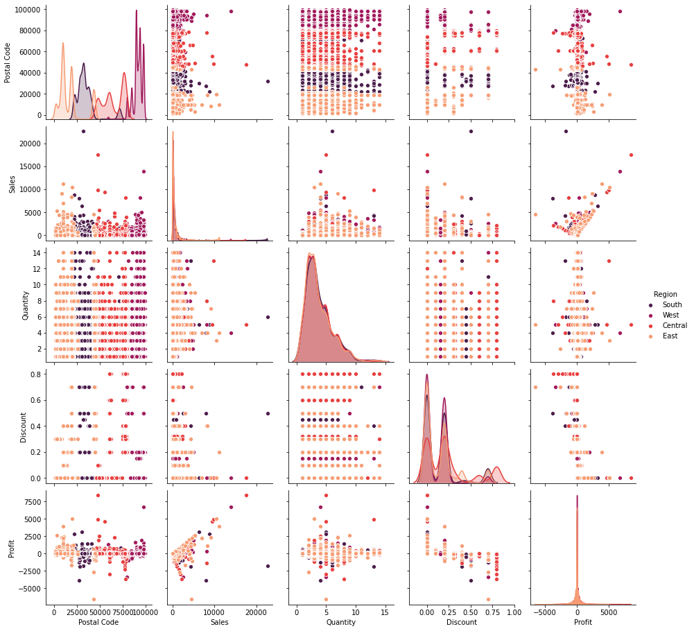


```python
plt.figure(figsize=(16,8))
plt.bar('Sub-Category', 'Category', data=df)
plt.show()
```


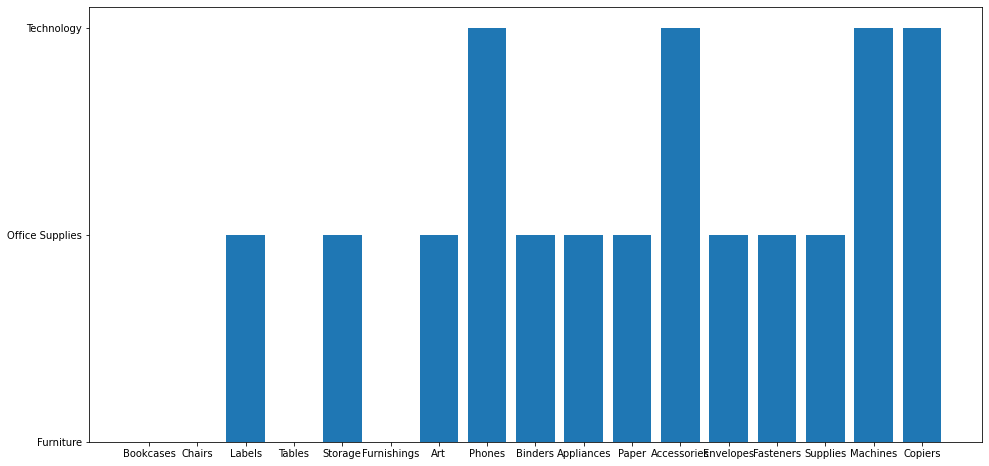


```python
#Frequect of the State wise 
print(df['State'].value_counts())
plt.figure(figsize=(15,8))
sns.countplot(x=df['State'])
plt.xticks(rotation=90)
plt.show()
```

    California              1996
    New York                1127
    Texas                    983
    Pennsylvania             586
    Washington               502
    Illinois                 491
    Ohio                     468
    Florida                  383
    Michigan                 254
    North Carolina           249
    Arizona                  224
    Virginia                 224
    Georgia                  184
    Tennessee                183
    Colorado                 182
    Indiana                  149
    Kentucky                 139
    Massachusetts            135
    New Jersey               130
    Oregon                   123
    Wisconsin                110
    Maryland                 105
    Delaware                  96
    Minnesota                 89
    Connecticut               82
    Oklahoma                  66
    Missouri                  66
    Alabama                   61
    Arkansas                  60
    Rhode Island              56
    Mississippi               53
    Utah                      53
    Louisiana                 42
    South Carolina            42
    Nevada                    39
    Nebraska                  38
    New Mexico                37
    Iowa                      30
    New Hampshire             27
    Kansas                    24
    Idaho                     21
    Montana                   15
    South Dakota              12
    Vermont                   11
    District of Columbia      10
    Maine                      8
    North Dakota               7
    West Virginia              4
    Wyoming                    1
    Name: State, dtype: int64
    


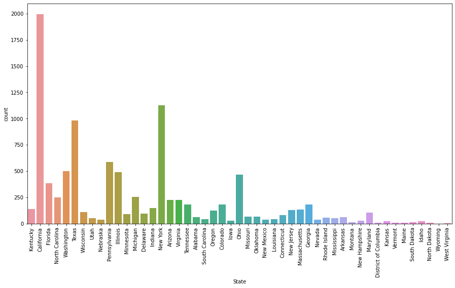


### Insight 1 - It it pertinent from the above graph that the California reorded the maximum sales among the states


```python
#Frequect of the Sub-Category wise 
print(df['Sub-Category'].value_counts())
plt.figure(figsize=(15,8))
sns.countplot(x=df['Sub-Category'])
plt.xticks(rotation=90)
plt.show()
```

    Binders        1522
    Paper          1359
    Furnishings     956
    Phones          889
    Storage         846
    Art             795
    Accessories     775
    Chairs          615
    Appliances      466
    Labels          363
    Tables          319
    Envelopes       254
    Bookcases       228
    Fasteners       217
    Supplies        190
    Machines        115
    Copiers          68
    Name: Sub-Category, dtype: int64
    


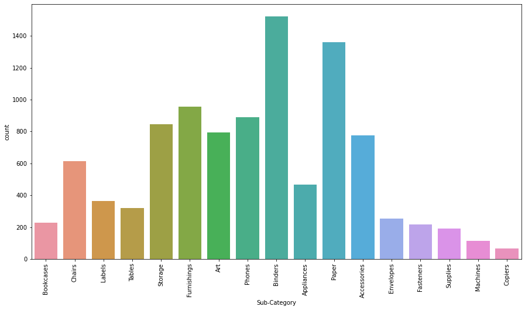


### Insight 2 - It it pertinent from the above graph that the Binders is most sold Sub Catagory.


```python
cor=df.corr() #Corelation 
```


```python
#Heatmap
sns.heatmap(cor, annot=True)
```


    <matplotlib.axes._subplots.AxesSubplot at 0x22c0c7f4760>


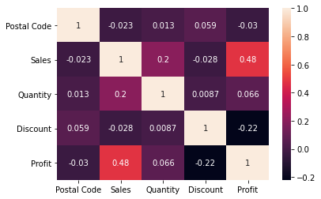


```python
#Plot for Discount Vs Profit
plt.figure(figsize=(10,4))
sns.lineplot('Discount', 'Profit', data=df, color ='g', label='Discount')
plt.legend()
```


    <matplotlib.legend.Legend at 0x22c0e09ed00>


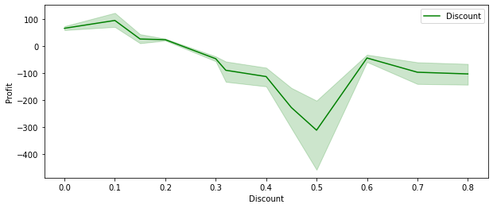


### Insight 3 - It it pertinent from both the above graph that  their is exist inverse corelation between Discount and Profit


```python
##Pie Chart for Share of different mode used for delivery
plt.figure(figsize = (6,6))
plt.title('SHIP MODE')
plt.pie(df['Ship Mode'].value_counts(), labels=df['Ship Mode'].value_counts().index, autopct = '%1.1f%%')
plt.show()
```


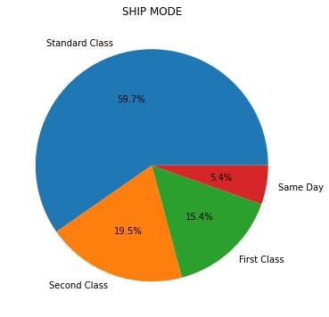


### Insight 4 - It it pertinent from above pie chart that, Standard Class is most prefered ship mode and Same Day is least prefered one.


```python
##Pie Chart for Share of sales in different Region
plt.figure(figsize = (6,6))
plt.title('REGION')
plt.pie(df['Region'].value_counts(), labels=df['Region'].value_counts().index, autopct = '%1.1f%%')
plt.show()
```


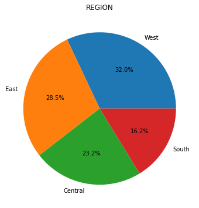


```python
#Plot for Quantity Vs Profit
plt.figure(figsize=(10,4))
sns.lineplot('Quantity', 'Profit', data=df, color ='b', label='Profit')
plt.legend()
```


    <matplotlib.legend.Legend at 0x22c0e1e4670>


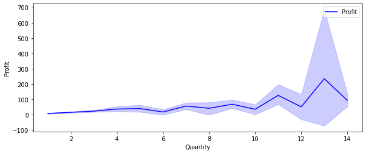


```python
#Plot for Profit Vs Region
plt.figure(figsize=(10,4))
sns.barplot('Profit', 'Region', data=df, color ='r', label='Profit')
plt.legend()
```


    <matplotlib.legend.Legend at 0x22c066002e0>


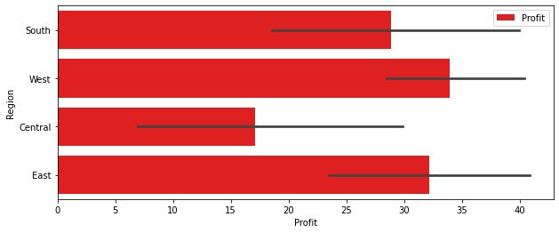

### Insight 5 - It it pertinent from above that, the Central region record the good sales but still not the best in terms of profit.


```python
##Pie Chart for Share of different segments
plt.figure(figsize = (6,6))
plt.title('SEGMENT')
plt.pie(df['Segment'].value_counts(), labels=df['Segment'].value_counts().index, autopct = '%1.1f%%')
plt.show()
```


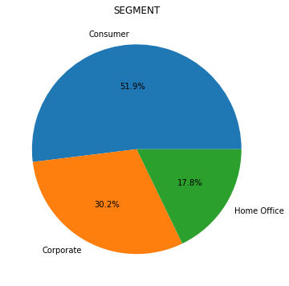

### Insight 6 - It it pertinent from above pie chart that, the Consumer is the most dominent segment. 

# Conclusion - the weak areas where we required to focus on are:
-  ***Only discount is not impacting the sale. So need to work on some different strategy.***
-  ***Central region records the good sales but profit is not significent and need to work on.***
