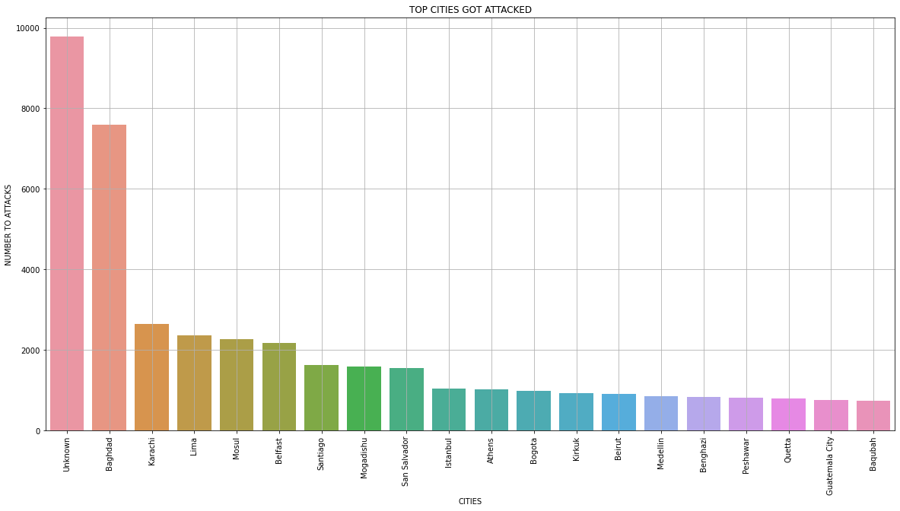

##  ***The Sparks Foundation - Data Science and Business Analytics Internship***

### ***Task no. 4 - Exploratory Data Analysis - Global Terrarism*** 

#### *Problem Statement - *
1. *As a security/defense analyst, try to find out the hot zone of terrorism.*
2. *What all security issues and insights you can derive by EDA?*

#### Dataset - https://bit.ly/2TK5Xn5

### Step 1 - IMPORT ALL THE REQUSIT LIBRARIES 


```python
#import the libraries. 
import numpy as np
import pandas as pd
import matplotlib.pyplot as plt
%matplotlib inline
from sklearn import datasets
import seaborn as sns
```

### Step 2 - LOAD THE DATA 


```python
#importing the data 
Terror_df = pd.read_csv('E:/TSF/Task4/globalterrorismdb_0718dist.csv', encoding='ISO-8859-1')
Terror_df.head() 
```

    C:\Users\ADMIN\anaconda3\lib\site-packages\IPython\core\interactiveshell.py:3071: DtypeWarning: Columns (4,6,31,33,61,62,63,76,79,90,92,94,96,114,115,121) have mixed types.Specify dtype option on import or set low_memory=False.
      has_raised = await self.run_ast_nodes(code_ast.body, cell_name,
    


<div>
<style scoped>
    .dataframe tbody tr th:only-of-type {
        vertical-align: middle;
    }

    .dataframe tbody tr th {
        vertical-align: top;
    }

    .dataframe thead th {
        text-align: right;
    }
</style>
<table border="1" class="dataframe">
  <thead>
    <tr style="text-align: right;">
      <th></th>
      <th>eventid</th>
      <th>iyear</th>
      <th>imonth</th>
      <th>iday</th>
      <th>approxdate</th>
      <th>extended</th>
      <th>resolution</th>
      <th>country</th>
      <th>country_txt</th>
      <th>region</th>
      <th>...</th>
      <th>addnotes</th>
      <th>scite1</th>
      <th>scite2</th>
      <th>scite3</th>
      <th>dbsource</th>
      <th>INT_LOG</th>
      <th>INT_IDEO</th>
      <th>INT_MISC</th>
      <th>INT_ANY</th>
      <th>related</th>
    </tr>
  </thead>
  <tbody>
    <tr>
      <th>0</th>
      <td>197000000001</td>
      <td>1970</td>
      <td>7</td>
      <td>2</td>
      <td>NaN</td>
      <td>0</td>
      <td>NaN</td>
      <td>58</td>
      <td>Dominican Republic</td>
      <td>2</td>
      <td>...</td>
      <td>NaN</td>
      <td>NaN</td>
      <td>NaN</td>
      <td>NaN</td>
      <td>PGIS</td>
      <td>0</td>
      <td>0</td>
      <td>0</td>
      <td>0</td>
      <td>NaN</td>
    </tr>
    <tr>
      <th>1</th>
      <td>197000000002</td>
      <td>1970</td>
      <td>0</td>
      <td>0</td>
      <td>NaN</td>
      <td>0</td>
      <td>NaN</td>
      <td>130</td>
      <td>Mexico</td>
      <td>1</td>
      <td>...</td>
      <td>NaN</td>
      <td>NaN</td>
      <td>NaN</td>
      <td>NaN</td>
      <td>PGIS</td>
      <td>0</td>
      <td>1</td>
      <td>1</td>
      <td>1</td>
      <td>NaN</td>
    </tr>
    <tr>
      <th>2</th>
      <td>197001000001</td>
      <td>1970</td>
      <td>1</td>
      <td>0</td>
      <td>NaN</td>
      <td>0</td>
      <td>NaN</td>
      <td>160</td>
      <td>Philippines</td>
      <td>5</td>
      <td>...</td>
      <td>NaN</td>
      <td>NaN</td>
      <td>NaN</td>
      <td>NaN</td>
      <td>PGIS</td>
      <td>-9</td>
      <td>-9</td>
      <td>1</td>
      <td>1</td>
      <td>NaN</td>
    </tr>
    <tr>
      <th>3</th>
      <td>197001000002</td>
      <td>1970</td>
      <td>1</td>
      <td>0</td>
      <td>NaN</td>
      <td>0</td>
      <td>NaN</td>
      <td>78</td>
      <td>Greece</td>
      <td>8</td>
      <td>...</td>
      <td>NaN</td>
      <td>NaN</td>
      <td>NaN</td>
      <td>NaN</td>
      <td>PGIS</td>
      <td>-9</td>
      <td>-9</td>
      <td>1</td>
      <td>1</td>
      <td>NaN</td>
    </tr>
    <tr>
      <th>4</th>
      <td>197001000003</td>
      <td>1970</td>
      <td>1</td>
      <td>0</td>
      <td>NaN</td>
      <td>0</td>
      <td>NaN</td>
      <td>101</td>
      <td>Japan</td>
      <td>4</td>
      <td>...</td>
      <td>NaN</td>
      <td>NaN</td>
      <td>NaN</td>
      <td>NaN</td>
      <td>PGIS</td>
      <td>-9</td>
      <td>-9</td>
      <td>1</td>
      <td>1</td>
      <td>NaN</td>
    </tr>
  </tbody>
</table>
<p>5 rows × 135 columns</p>
</div>


### Step 3 - DATASET INFORMATION


```python
Terror_df.shape
```


    (181691, 135)


```python
Terror_df.info()
```

    <class 'pandas.core.frame.DataFrame'>
    RangeIndex: 181691 entries, 0 to 181690
    Columns: 135 entries, eventid to related
    dtypes: float64(55), int64(22), object(58)
    memory usage: 187.1+ MB
    


```python
#Check for null values 
Terror_df.isnull().sum()
```


    eventid            0
    iyear              0
    imonth             0
    iday               0
    approxdate    172452
                   ...  
    INT_LOG            0
    INT_IDEO           0
    INT_MISC           0
    INT_ANY            0
    related       156653
    Length: 135, dtype: int64


```python
#Check for duplication 
Terror_df.duplicated().sum()
```


    0


```python
Terror_df.describe()
```


<div>
<style scoped>
    .dataframe tbody tr th:only-of-type {
        vertical-align: middle;
    }

    .dataframe tbody tr th {
        vertical-align: top;
    }

    .dataframe thead th {
        text-align: right;
    }
</style>
<table border="1" class="dataframe">
  <thead>
    <tr style="text-align: right;">
      <th></th>
      <th>eventid</th>
      <th>iyear</th>
      <th>imonth</th>
      <th>iday</th>
      <th>extended</th>
      <th>country</th>
      <th>region</th>
      <th>latitude</th>
      <th>longitude</th>
      <th>specificity</th>
      <th>...</th>
      <th>ransomamt</th>
      <th>ransomamtus</th>
      <th>ransompaid</th>
      <th>ransompaidus</th>
      <th>hostkidoutcome</th>
      <th>nreleased</th>
      <th>INT_LOG</th>
      <th>INT_IDEO</th>
      <th>INT_MISC</th>
      <th>INT_ANY</th>
    </tr>
  </thead>
  <tbody>
    <tr>
      <th>count</th>
      <td>1.816910e+05</td>
      <td>181691.000000</td>
      <td>181691.000000</td>
      <td>181691.000000</td>
      <td>181691.000000</td>
      <td>181691.000000</td>
      <td>181691.000000</td>
      <td>177135.000000</td>
      <td>1.771340e+05</td>
      <td>181685.000000</td>
      <td>...</td>
      <td>1.350000e+03</td>
      <td>5.630000e+02</td>
      <td>7.740000e+02</td>
      <td>552.000000</td>
      <td>10991.000000</td>
      <td>10400.000000</td>
      <td>181691.000000</td>
      <td>181691.000000</td>
      <td>181691.000000</td>
      <td>181691.000000</td>
    </tr>
    <tr>
      <th>mean</th>
      <td>2.002705e+11</td>
      <td>2002.638997</td>
      <td>6.467277</td>
      <td>15.505644</td>
      <td>0.045346</td>
      <td>131.968501</td>
      <td>7.160938</td>
      <td>23.498343</td>
      <td>-4.586957e+02</td>
      <td>1.451452</td>
      <td>...</td>
      <td>3.172530e+06</td>
      <td>5.784865e+05</td>
      <td>7.179437e+05</td>
      <td>240.378623</td>
      <td>4.629242</td>
      <td>-29.018269</td>
      <td>-4.543731</td>
      <td>-4.464398</td>
      <td>0.090010</td>
      <td>-3.945952</td>
    </tr>
    <tr>
      <th>std</th>
      <td>1.325957e+09</td>
      <td>13.259430</td>
      <td>3.388303</td>
      <td>8.814045</td>
      <td>0.208063</td>
      <td>112.414535</td>
      <td>2.933408</td>
      <td>18.569242</td>
      <td>2.047790e+05</td>
      <td>0.995430</td>
      <td>...</td>
      <td>3.021157e+07</td>
      <td>7.077924e+06</td>
      <td>1.014392e+07</td>
      <td>2940.967293</td>
      <td>2.035360</td>
      <td>65.720119</td>
      <td>4.543547</td>
      <td>4.637152</td>
      <td>0.568457</td>
      <td>4.691325</td>
    </tr>
    <tr>
      <th>min</th>
      <td>1.970000e+11</td>
      <td>1970.000000</td>
      <td>0.000000</td>
      <td>0.000000</td>
      <td>0.000000</td>
      <td>4.000000</td>
      <td>1.000000</td>
      <td>-53.154613</td>
      <td>-8.618590e+07</td>
      <td>1.000000</td>
      <td>...</td>
      <td>-9.900000e+01</td>
      <td>-9.900000e+01</td>
      <td>-9.900000e+01</td>
      <td>-99.000000</td>
      <td>1.000000</td>
      <td>-99.000000</td>
      <td>-9.000000</td>
      <td>-9.000000</td>
      <td>-9.000000</td>
      <td>-9.000000</td>
    </tr>
    <tr>
      <th>25%</th>
      <td>1.991021e+11</td>
      <td>1991.000000</td>
      <td>4.000000</td>
      <td>8.000000</td>
      <td>0.000000</td>
      <td>78.000000</td>
      <td>5.000000</td>
      <td>11.510046</td>
      <td>4.545640e+00</td>
      <td>1.000000</td>
      <td>...</td>
      <td>0.000000e+00</td>
      <td>0.000000e+00</td>
      <td>-9.900000e+01</td>
      <td>0.000000</td>
      <td>2.000000</td>
      <td>-99.000000</td>
      <td>-9.000000</td>
      <td>-9.000000</td>
      <td>0.000000</td>
      <td>-9.000000</td>
    </tr>
    <tr>
      <th>50%</th>
      <td>2.009022e+11</td>
      <td>2009.000000</td>
      <td>6.000000</td>
      <td>15.000000</td>
      <td>0.000000</td>
      <td>98.000000</td>
      <td>6.000000</td>
      <td>31.467463</td>
      <td>4.324651e+01</td>
      <td>1.000000</td>
      <td>...</td>
      <td>1.500000e+04</td>
      <td>0.000000e+00</td>
      <td>0.000000e+00</td>
      <td>0.000000</td>
      <td>4.000000</td>
      <td>0.000000</td>
      <td>-9.000000</td>
      <td>-9.000000</td>
      <td>0.000000</td>
      <td>0.000000</td>
    </tr>
    <tr>
      <th>75%</th>
      <td>2.014081e+11</td>
      <td>2014.000000</td>
      <td>9.000000</td>
      <td>23.000000</td>
      <td>0.000000</td>
      <td>160.000000</td>
      <td>10.000000</td>
      <td>34.685087</td>
      <td>6.871033e+01</td>
      <td>1.000000</td>
      <td>...</td>
      <td>4.000000e+05</td>
      <td>0.000000e+00</td>
      <td>1.273412e+03</td>
      <td>0.000000</td>
      <td>7.000000</td>
      <td>1.000000</td>
      <td>0.000000</td>
      <td>0.000000</td>
      <td>0.000000</td>
      <td>0.000000</td>
    </tr>
    <tr>
      <th>max</th>
      <td>2.017123e+11</td>
      <td>2017.000000</td>
      <td>12.000000</td>
      <td>31.000000</td>
      <td>1.000000</td>
      <td>1004.000000</td>
      <td>12.000000</td>
      <td>74.633553</td>
      <td>1.793667e+02</td>
      <td>5.000000</td>
      <td>...</td>
      <td>1.000000e+09</td>
      <td>1.320000e+08</td>
      <td>2.750000e+08</td>
      <td>48000.000000</td>
      <td>7.000000</td>
      <td>2769.000000</td>
      <td>1.000000</td>
      <td>1.000000</td>
      <td>1.000000</td>
      <td>1.000000</td>
    </tr>
  </tbody>
</table>
<p>8 rows × 77 columns</p>
</div>


```python
Terror_df.corr()
```


<div>
<style scoped>
    .dataframe tbody tr th:only-of-type {
        vertical-align: middle;
    }

    .dataframe tbody tr th {
        vertical-align: top;
    }

    .dataframe thead th {
        text-align: right;
    }
</style>
<table border="1" class="dataframe">
  <thead>
    <tr style="text-align: right;">
      <th></th>
      <th>eventid</th>
      <th>iyear</th>
      <th>imonth</th>
      <th>iday</th>
      <th>extended</th>
      <th>country</th>
      <th>region</th>
      <th>latitude</th>
      <th>longitude</th>
      <th>specificity</th>
      <th>...</th>
      <th>ransomamt</th>
      <th>ransomamtus</th>
      <th>ransompaid</th>
      <th>ransompaidus</th>
      <th>hostkidoutcome</th>
      <th>nreleased</th>
      <th>INT_LOG</th>
      <th>INT_IDEO</th>
      <th>INT_MISC</th>
      <th>INT_ANY</th>
    </tr>
  </thead>
  <tbody>
    <tr>
      <th>eventid</th>
      <td>1.000000</td>
      <td>0.999996</td>
      <td>0.002706</td>
      <td>0.018336</td>
      <td>0.091761</td>
      <td>-0.135039</td>
      <td>0.401371</td>
      <td>0.166886</td>
      <td>0.003907</td>
      <td>0.030641</td>
      <td>...</td>
      <td>-0.009990</td>
      <td>-0.018001</td>
      <td>-0.014094</td>
      <td>-0.165422</td>
      <td>0.256113</td>
      <td>-0.181612</td>
      <td>-0.143600</td>
      <td>-0.133252</td>
      <td>-0.077852</td>
      <td>-0.175605</td>
    </tr>
    <tr>
      <th>iyear</th>
      <td>0.999996</td>
      <td>1.000000</td>
      <td>0.000139</td>
      <td>0.018254</td>
      <td>0.091754</td>
      <td>-0.135023</td>
      <td>0.401384</td>
      <td>0.166933</td>
      <td>0.003917</td>
      <td>0.030626</td>
      <td>...</td>
      <td>-0.009984</td>
      <td>-0.018216</td>
      <td>-0.014238</td>
      <td>-0.165375</td>
      <td>0.256092</td>
      <td>-0.181556</td>
      <td>-0.143601</td>
      <td>-0.133253</td>
      <td>-0.077847</td>
      <td>-0.175596</td>
    </tr>
    <tr>
      <th>imonth</th>
      <td>0.002706</td>
      <td>0.000139</td>
      <td>1.000000</td>
      <td>0.005497</td>
      <td>-0.000468</td>
      <td>-0.006305</td>
      <td>-0.002999</td>
      <td>-0.015978</td>
      <td>-0.003880</td>
      <td>0.003621</td>
      <td>...</td>
      <td>-0.000710</td>
      <td>0.046989</td>
      <td>0.058878</td>
      <td>-0.016597</td>
      <td>0.011295</td>
      <td>-0.011535</td>
      <td>-0.002302</td>
      <td>-0.002034</td>
      <td>-0.002554</td>
      <td>-0.006336</td>
    </tr>
    <tr>
      <th>iday</th>
      <td>0.018336</td>
      <td>0.018254</td>
      <td>0.005497</td>
      <td>1.000000</td>
      <td>-0.004700</td>
      <td>0.003468</td>
      <td>0.009710</td>
      <td>0.003423</td>
      <td>-0.002285</td>
      <td>-0.006991</td>
      <td>...</td>
      <td>0.012755</td>
      <td>-0.010502</td>
      <td>0.003148</td>
      <td>-0.006581</td>
      <td>-0.006706</td>
      <td>0.001765</td>
      <td>-0.001540</td>
      <td>-0.001621</td>
      <td>-0.002027</td>
      <td>-0.001199</td>
    </tr>
    <tr>
      <th>extended</th>
      <td>0.091761</td>
      <td>0.091754</td>
      <td>-0.000468</td>
      <td>-0.004700</td>
      <td>1.000000</td>
      <td>-0.020466</td>
      <td>0.038389</td>
      <td>-0.024749</td>
      <td>0.000523</td>
      <td>0.057897</td>
      <td>...</td>
      <td>-0.008114</td>
      <td>0.028177</td>
      <td>0.001966</td>
      <td>0.009367</td>
      <td>0.233293</td>
      <td>-0.192155</td>
      <td>0.071768</td>
      <td>0.075147</td>
      <td>0.027335</td>
      <td>0.080767</td>
    </tr>
    <tr>
      <th>...</th>
      <td>...</td>
      <td>...</td>
      <td>...</td>
      <td>...</td>
      <td>...</td>
      <td>...</td>
      <td>...</td>
      <td>...</td>
      <td>...</td>
      <td>...</td>
      <td>...</td>
      <td>...</td>
      <td>...</td>
      <td>...</td>
      <td>...</td>
      <td>...</td>
      <td>...</td>
      <td>...</td>
      <td>...</td>
      <td>...</td>
      <td>...</td>
    </tr>
    <tr>
      <th>nreleased</th>
      <td>-0.181612</td>
      <td>-0.181556</td>
      <td>-0.011535</td>
      <td>0.001765</td>
      <td>-0.192155</td>
      <td>-0.044331</td>
      <td>-0.149511</td>
      <td>0.002790</td>
      <td>-0.017745</td>
      <td>-0.030631</td>
      <td>...</td>
      <td>0.054571</td>
      <td>0.034843</td>
      <td>0.049322</td>
      <td>0.016832</td>
      <td>-0.555478</td>
      <td>1.000000</td>
      <td>0.039388</td>
      <td>0.040947</td>
      <td>0.085055</td>
      <td>0.064759</td>
    </tr>
    <tr>
      <th>INT_LOG</th>
      <td>-0.143600</td>
      <td>-0.143601</td>
      <td>-0.002302</td>
      <td>-0.001540</td>
      <td>0.071768</td>
      <td>0.069904</td>
      <td>-0.082584</td>
      <td>-0.099827</td>
      <td>0.002272</td>
      <td>0.073022</td>
      <td>...</td>
      <td>0.035821</td>
      <td>0.031079</td>
      <td>0.007029</td>
      <td>-0.045504</td>
      <td>-0.015442</td>
      <td>0.039388</td>
      <td>1.000000</td>
      <td>0.996211</td>
      <td>0.052537</td>
      <td>0.891051</td>
    </tr>
    <tr>
      <th>INT_IDEO</th>
      <td>-0.133252</td>
      <td>-0.133253</td>
      <td>-0.002034</td>
      <td>-0.001621</td>
      <td>0.075147</td>
      <td>0.067564</td>
      <td>-0.071917</td>
      <td>-0.094470</td>
      <td>0.002268</td>
      <td>0.071333</td>
      <td>...</td>
      <td>0.039053</td>
      <td>0.041983</td>
      <td>0.013162</td>
      <td>-0.039844</td>
      <td>-0.016234</td>
      <td>0.040947</td>
      <td>0.996211</td>
      <td>1.000000</td>
      <td>0.082014</td>
      <td>0.893811</td>
    </tr>
    <tr>
      <th>INT_MISC</th>
      <td>-0.077852</td>
      <td>-0.077847</td>
      <td>-0.002554</td>
      <td>-0.002027</td>
      <td>0.027335</td>
      <td>0.207281</td>
      <td>0.043139</td>
      <td>0.097652</td>
      <td>0.000371</td>
      <td>-0.019197</td>
      <td>...</td>
      <td>0.023815</td>
      <td>0.125162</td>
      <td>0.037227</td>
      <td>0.129274</td>
      <td>-0.119776</td>
      <td>0.085055</td>
      <td>0.052537</td>
      <td>0.082014</td>
      <td>1.000000</td>
      <td>0.252193</td>
    </tr>
    <tr>
      <th>INT_ANY</th>
      <td>-0.175605</td>
      <td>-0.175596</td>
      <td>-0.006336</td>
      <td>-0.001199</td>
      <td>0.080767</td>
      <td>0.153118</td>
      <td>-0.047900</td>
      <td>-0.041530</td>
      <td>0.002497</td>
      <td>0.061389</td>
      <td>...</td>
      <td>0.028054</td>
      <td>0.053484</td>
      <td>0.007275</td>
      <td>0.056438</td>
      <td>-0.061946</td>
      <td>0.064759</td>
      <td>0.891051</td>
      <td>0.893811</td>
      <td>0.252193</td>
      <td>1.000000</td>
    </tr>
  </tbody>
</table>
<p>77 rows × 77 columns</p>
</div>


### Step 4 - Modification in Dataframe


```python
# Coulumn names
Terror_df.columns 
```


    Index(['eventid', 'iyear', 'imonth', 'iday', 'approxdate', 'extended',
           'resolution', 'country', 'country_txt', 'region',
           ...
           'addnotes', 'scite1', 'scite2', 'scite3', 'dbsource', 'INT_LOG',
           'INT_IDEO', 'INT_MISC', 'INT_ANY', 'related'],
          dtype='object', length=135)


Chnaging the Column name


```python
Terror_df.rename(columns={'iyear':'Year','imonth':'Month','iday':'Day','country_txt':'Country','provstate':'state',
                       'region_txt':'Region','attacktype1_txt':'AttackType','target1':'Target','nkill':'Killed',
                       'nwound':'Wounded','summary':'Summary','gname':'Group','targtype1_txt':'Target_type',
                       'weaptype1_txt':'Weapon_type','motive':'Motive'},inplace=True)
```


```python
# Let's just take important columns for further analysis.

Terror_df = Terror_df[['Year','Month','Day','Country','state','Region','city','latitude','longitude','AttackType','Killed',
               'Wounded','Target','Summary','Group','Target_type','Weapon_type','Motive']]
```


```python
Terror_df.head()
```


<div>
<style scoped>
    .dataframe tbody tr th:only-of-type {
        vertical-align: middle;
    }

    .dataframe tbody tr th {
        vertical-align: top;
    }

    .dataframe thead th {
        text-align: right;
    }
</style>
<table border="1" class="dataframe">
  <thead>
    <tr style="text-align: right;">
      <th></th>
      <th>Year</th>
      <th>Month</th>
      <th>Day</th>
      <th>Country</th>
      <th>state</th>
      <th>Region</th>
      <th>city</th>
      <th>latitude</th>
      <th>longitude</th>
      <th>AttackType</th>
      <th>Killed</th>
      <th>Wounded</th>
      <th>Target</th>
      <th>Summary</th>
      <th>Group</th>
      <th>Target_type</th>
      <th>Weapon_type</th>
      <th>Motive</th>
    </tr>
  </thead>
  <tbody>
    <tr>
      <th>0</th>
      <td>1970</td>
      <td>7</td>
      <td>2</td>
      <td>Dominican Republic</td>
      <td>NaN</td>
      <td>Central America &amp; Caribbean</td>
      <td>Santo Domingo</td>
      <td>18.456792</td>
      <td>-69.951164</td>
      <td>Assassination</td>
      <td>1.0</td>
      <td>0.0</td>
      <td>Julio Guzman</td>
      <td>NaN</td>
      <td>MANO-D</td>
      <td>Private Citizens &amp; Property</td>
      <td>Unknown</td>
      <td>NaN</td>
    </tr>
    <tr>
      <th>1</th>
      <td>1970</td>
      <td>0</td>
      <td>0</td>
      <td>Mexico</td>
      <td>Federal</td>
      <td>North America</td>
      <td>Mexico city</td>
      <td>19.371887</td>
      <td>-99.086624</td>
      <td>Hostage Taking (Kidnapping)</td>
      <td>0.0</td>
      <td>0.0</td>
      <td>Nadine Chaval, daughter</td>
      <td>NaN</td>
      <td>23rd of September Communist League</td>
      <td>Government (Diplomatic)</td>
      <td>Unknown</td>
      <td>NaN</td>
    </tr>
    <tr>
      <th>2</th>
      <td>1970</td>
      <td>1</td>
      <td>0</td>
      <td>Philippines</td>
      <td>Tarlac</td>
      <td>Southeast Asia</td>
      <td>Unknown</td>
      <td>15.478598</td>
      <td>120.599741</td>
      <td>Assassination</td>
      <td>1.0</td>
      <td>0.0</td>
      <td>Employee</td>
      <td>NaN</td>
      <td>Unknown</td>
      <td>Journalists &amp; Media</td>
      <td>Unknown</td>
      <td>NaN</td>
    </tr>
    <tr>
      <th>3</th>
      <td>1970</td>
      <td>1</td>
      <td>0</td>
      <td>Greece</td>
      <td>Attica</td>
      <td>Western Europe</td>
      <td>Athens</td>
      <td>37.997490</td>
      <td>23.762728</td>
      <td>Bombing/Explosion</td>
      <td>NaN</td>
      <td>NaN</td>
      <td>U.S. Embassy</td>
      <td>NaN</td>
      <td>Unknown</td>
      <td>Government (Diplomatic)</td>
      <td>Explosives</td>
      <td>NaN</td>
    </tr>
    <tr>
      <th>4</th>
      <td>1970</td>
      <td>1</td>
      <td>0</td>
      <td>Japan</td>
      <td>Fukouka</td>
      <td>East Asia</td>
      <td>Fukouka</td>
      <td>33.580412</td>
      <td>130.396361</td>
      <td>Facility/Infrastructure Attack</td>
      <td>NaN</td>
      <td>NaN</td>
      <td>U.S. Consulate</td>
      <td>NaN</td>
      <td>Unknown</td>
      <td>Government (Diplomatic)</td>
      <td>Incendiary</td>
      <td>NaN</td>
    </tr>
  </tbody>
</table>
</div>


```python
Terror_df.info()
```

    <class 'pandas.core.frame.DataFrame'>
    RangeIndex: 181691 entries, 0 to 181690
    Data columns (total 18 columns):
     #   Column       Non-Null Count   Dtype  
    ---  ------       --------------   -----  
     0   Year         181691 non-null  int64  
     1   Month        181691 non-null  int64  
     2   Day          181691 non-null  int64  
     3   Country      181691 non-null  object 
     4   state        181270 non-null  object 
     5   Region       181691 non-null  object 
     6   city         181257 non-null  object 
     7   latitude     177135 non-null  float64
     8   longitude    177134 non-null  float64
     9   AttackType   181691 non-null  object 
     10  Killed       171378 non-null  float64
     11  Wounded      165380 non-null  float64
     12  Target       181055 non-null  object 
     13  Summary      115562 non-null  object 
     14  Group        181691 non-null  object 
     15  Target_type  181691 non-null  object 
     16  Weapon_type  181691 non-null  object 
     17  Motive       50561 non-null   object 
    dtypes: float64(4), int64(3), object(11)
    memory usage: 25.0+ MB
    

### Step 5  - USING PAIR PLOT TO IDENTFY RELATIONSHIP BETWEEN DIFFERENT FEATURES


```python
#Check the corelation between the different perameters.
sns.pairplot(Terror_df, hue = 'Region')
plt.show()
```

    C:\Users\ADMIN\anaconda3\lib\site-packages\seaborn\distributions.py:369: UserWarning: Default bandwidth for data is 0; skipping density estimation.
      warnings.warn(msg, UserWarning)
    C:\Users\ADMIN\anaconda3\lib\site-packages\seaborn\distributions.py:369: UserWarning: Default bandwidth for data is 0; skipping density estimation.
      warnings.warn(msg, UserWarning)
    C:\Users\ADMIN\anaconda3\lib\site-packages\seaborn\distributions.py:369: UserWarning: Default bandwidth for data is 0; skipping density estimation.
      warnings.warn(msg, UserWarning)
    C:\Users\ADMIN\anaconda3\lib\site-packages\seaborn\distributions.py:369: UserWarning: Default bandwidth for data is 0; skipping density estimation.
      warnings.warn(msg, UserWarning)
    C:\Users\ADMIN\anaconda3\lib\site-packages\seaborn\distributions.py:369: UserWarning: Default bandwidth for data is 0; skipping density estimation.
      warnings.warn(msg, UserWarning)
    C:\Users\ADMIN\anaconda3\lib\site-packages\seaborn\distributions.py:369: UserWarning: Default bandwidth for data is 0; skipping density estimation.
      warnings.warn(msg, UserWarning)
    C:\Users\ADMIN\anaconda3\lib\site-packages\seaborn\distributions.py:369: UserWarning: Default bandwidth for data is 0; skipping density estimation.
      warnings.warn(msg, UserWarning)
    C:\Users\ADMIN\anaconda3\lib\site-packages\seaborn\distributions.py:369: UserWarning: Default bandwidth for data is 0; skipping density estimation.
      warnings.warn(msg, UserWarning)
    C:\Users\ADMIN\anaconda3\lib\site-packages\seaborn\distributions.py:369: UserWarning: Default bandwidth for data is 0; skipping density estimation.
      warnings.warn(msg, UserWarning)
    


### COUNTRIES AFFECTED BY TERRORIST ATTACKS


```python
Terror_df['Country'].value_counts().head()
```


    Iraq           24636
    Pakistan       14368
    Afghanistan    12731
    India          11960
    Colombia        8306
    Name: Country, dtype: int64


```python
Terror_df['Country'].value_counts().tail()
```


    South Vietnam       1
    Andorra             1
    Falkland Islands    1
    Vatican City        1
    North Korea         1
    Name: Country, dtype: int64


```python
Terror_df['Country'].value_counts()
plt.figure(figsize=(20,10))
sns.barplot(x=Terror_df['Country'].value_counts()[:20].index,y=Terror_df['Country'].value_counts()[:20].values)
plt.title('TOP COUNTRIES GOT ATTACKED')
plt.xticks(rotation=90)
plt.xlabel('COUNTRIES')
plt.ylabel('NUMBER TO ATTACKS')
plt.grid()
plt.show()
```


#Con1: Iran, Pakistan, Afghanistan, India and Colombia are the top five countries, who were suffered the most number of terrorist attackes and which are amoungt the countries with the Muslim majority or having sizable muslim population. 

### REGION AFFECTED BY TERRORIST ATTACKS


```python
print('Region with most attacks: ' + Terror_df['Region'].value_counts().idxmax())
```

    Region with most attacks: Middle East & North Africa
    


```python
Terror_df['Region'].value_counts()
plt.figure(figsize=(20,10))
sns.countplot(x='Region',data=Terror_df)
plt.xticks(rotation=90)
plt.grid()
plt.show()
```


#Con2: Though the Middle East & North Africa and South Asia are the two most affected regions of the world but West Europe and South America also impacted substantly. Whereas the East Asia and Australia & Oceania are the most peacfull region. Middle East & North Africa is boiling in the heat of Arab spring which fueled by severl socio-economic challenges as well the dictator or authoritarian regimes. East Asia and Australia & Oceania are the most peacfull region. 

### CITIES AFFECTED BY TERRORIST


```python
Terror_df['city'].value_counts()
```


    Unknown           9775
    Baghdad           7589
    Karachi           2652
    Lima              2359
    Mosul             2265
                      ... 
    Taungpyo-Letwe       1
    Rho                  1
    Valvidia             1
    Cadoldolan           1
    Ispingo              1
    Name: city, Length: 36674, dtype: int64


```python
Terror_df['city'].value_counts()
plt.figure(figsize=(20,10))
sns.barplot(x=Terror_df['city'].value_counts()[:20].index,y=Terror_df['city'].value_counts()[:20].values)
plt.title('TOP CITIES GOT ATTACKED')
plt.xticks(rotation=90)
plt.xlabel('CITIES')
plt.ylabel('NUMBER TO ATTACKS')
plt.grid()
plt.show()
```





### TREAND OF ATTACKS FROM 1970 TO 2017


```python
plt.subplots(figsize=(20,10))
sns.countplot(x='Year',data=Terror_df,palette='tab10')
plt.xticks(rotation=90)
plt.title('TERROR ATTACKS FROM 1970 TO 2017')
plt.grid()
plt.show()
```


#Con3: Above graph indicates that, there is sudden spick observed from the year 1978 to 1997 and than, from 2011 to 2015,  and since 2015 it is decresing. The 1978 - 1997 were the years which recored several historic events, to name a few was Creation of Bandladesh as new nation (Indo-Pak War 1971), Iraq war, USSR invesion to Afghanistan and retreat after disintregration, USA investion in Afghanistan, Kargil War.   

### TYPE OF ATTACK USED BY TERRORISTS


```python
plt.figure(figsize=(10,10))
sns.countplot(x=Terror_df['AttackType'],order=Terror_df['AttackType'].value_counts().index,palette='rainbow')
plt.xticks(rotation=90)
plt.xlabel('ATTACK TYPE')
plt.ylabel('NUMBER OF ATTACKS')
plt.grid()
plt.show()
```


#Con4: Bombing/Explosion is the most perfered attack type used for mass distruction followed by Armed assault.Due increse in security level and Technical modernization of armed forces, Hijacking and Hostages are less prefered option.

### WEAPON USED FOR SUPPORTING THE ATTACK TYPE VISUA


```python
Terror_df['Weapon_type'].value_counts()
plt.figure(figsize=(20,10))
color=['lightblue','red','lightpink','brown']
sns.barplot(x=Terror_df['Weapon_type'].value_counts()[:20].index,y=Terror_df['Weapon_type'].value_counts()[:20].values , palette=color)
plt.title('WEAPON USAGE')
plt.xticks(rotation=90)
plt.xlabel('WEAPON USED')
plt.ylabel('NUMBER OF TIMES')
plt.grid()
plt.show()
```


#Con5: Explosion is the most perfered weapon used for mass distruction followed by firearms.Somethings which United Nation and their member nation need to bother for is the pronsness of getting the Biological and Radiological weapons in the hand of any such groups which have backings from nuclear power nations with weak political controle. Example - Pakistan 


### ATTACK TARGETS


```python
Terror_df['Target_type'].value_counts()
```


    Private Citizens & Property       43511
    Military                          27984
    Police                            24506
    Government (General)              21283
    Business                          20669
    Transportation                     6799
    Utilities                          6023
    Unknown                            5898
    Religious Figures/Institutions     4440
    Educational Institution            4322
    Government (Diplomatic)            3573
    Terrorists/Non-State Militia       3039
    Journalists & Media                2948
    Violent Political Party            1866
    Airports & Aircraft                1343
    Telecommunication                  1009
    NGO                                 970
    Tourists                            440
    Maritime                            351
    Food or Water Supply                317
    Abortion Related                    263
    Other                               137
    Name: Target_type, dtype: int64


```python
plt.figure(figsize=(20,10))
sns.countplot(x=Terror_df['Target_type'],order=Terror_df['Target_type'].value_counts().index,palette='rainbow')
plt.xticks(rotation=90)
plt.xlabel('TARGETS')
plt.ylabel('NUMBER OF TARGETS')
plt.grid()
plt.show()
```


#Con6: Private Citizen & Property apper the most prefred soft target for the terorr groups to spread thread and fear. This targets are instrumental in impacting the counrty economically as well as socially. 

### NAME OF GROUP ATTACKS TERRORIST


```python
plt.figure(figsize=(15,6))
sns.barplot(x=Terror_df['Group'].value_counts()[:20].index,y=Terror_df['Group'].value_counts()[:20].values,palette='pastel')
plt.xticks(rotation=90)
plt.title('TOATAL GROUP ATTACKS')
plt.xlabel('GROUP NAME')
plt.ylabel('TOATAL NUMBER OF ATTACKS')
plt.grid()
plt.show()
```


#Con7: Terorr groups who responsibile for the majore attacks are Unknown groups and are spread across the countries. The known terorr groups are either religioslly or politically motiveted with some vested intrests countries.   

Final OBSERVATIONS - 

1. Iran, Pakistan, Afghanistan, India and Colombia are the top five countries, who were suffered the most number of terrorist attackes and which are amoungt the countries with the Muslim majority or having sizable muslim population.

2. Though the Middle East & North Africa and South Asia are the two most affected regions of the world but West Europe and South America also impacted substantly. Whereas the East Asia and Australia & Oceania are the most peacfull region.

3. There is sudden spick observed from the year 1978 to 1997 and than, from 2011 to 2015,  and since 2015 it is decresing. Constant efforts on India has paved the way to recognize "Terorr" as a treath to humanity in UN.

4. Bombing/Explosion is the most perfered attack type used for mass distruction as it provide maximum opporunity to escape, followed by Armed assault.

5. Explosion & firearms the most perfered attack type used for The mass distruction. Although the Biological and Radiological weapons are still out of there (Terorr Groups) reach, but how long this is a matter of concern.

7. Private Citizen & Property and Business are apper to be the most prefred soft target for the terorr groups to spread threat and fear. This targets are instrumental in impacting the counrty's economy as well as social order. 

